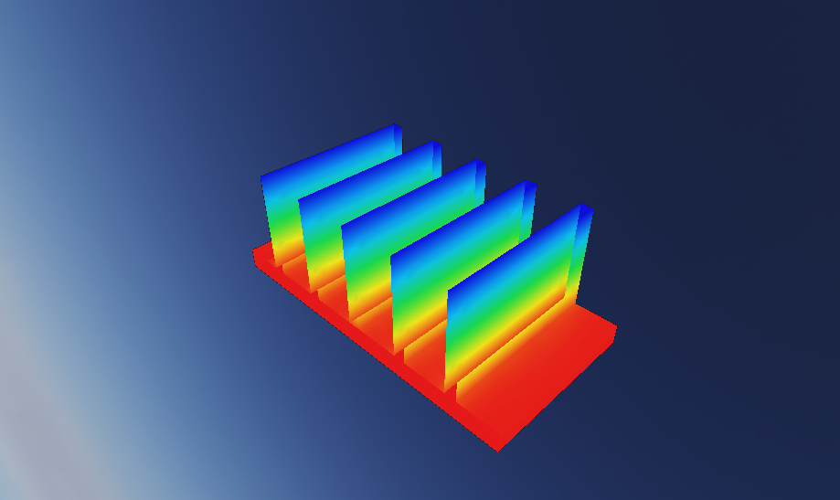
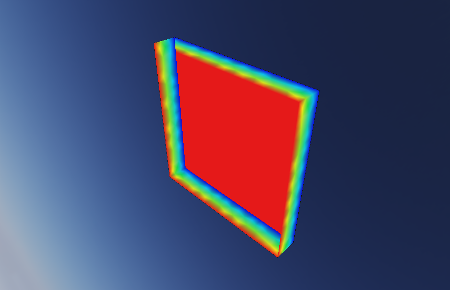

# GetDP demo studies

Bundled, fully-parametric tutorial documents. Each demo is a Go **geometry program**
(built against the `Author` seam) plus a configured GetDP study, so it unit-tests with no
live host and the engine replays it as real host geometry. Build one from the **GetDP ▸
Demos** ribbon panel, then **Solve ▸ Run Study** to mesh and solve.

Both demos follow the workspace part-design rules: named parameters, formulas for derived
dimensions, one sketch per feature, a driving dimension on every feature input, and a
fully-constrained (DOF = 0) profile. Lengths are authored in millimetres; the host model
unit is 1 cm = 10 mm.

## Busbar (electrokinetics)

A 200 × 10 × 10 mm copper bar. A fixed potential on one end cap and ground on the other
drive a steady conduction current along the bar's axis (+Z). The default region material is
copper (σ = 5.96 × 10⁷ S/m).

Geometric host parameters (edit any to re-drive the bar):

| Parameter    | Value  | Role                                    |
| ------------ | ------ | --------------------------------------- |
| `bar_length` | 200 mm | Bar length — the current-flow axis (+Z) |
| `bar_width`  | 10 mm  | Cross-section width (X)                  |
| `bar_height` | 10 mm  | Cross-section height (Y)                 |

**Study driver:** `drive_voltage` = 1 V (applied as a boundary-condition value, not a host
parameter — the host parameter engine carries only geometric units).

**Boundary conditions:** `V+` (1 V) on the z = 0 cap, `Ground` (0 V) on the z = length cap.

**Analytic oracle.** For a prism the resistance is exactly `R = L / (σ·A)`, so the electrode
current is `I = V·σ·A / L`. With the default copper and dimensions above,
`I = 1 · 5.96e7 · 1e-4 / 0.2 ≈ 29.8 kA`. The engine's real-toolchain busbar test asserts
this to 1 %.

## Heat sink (steady thermal)

An 80 × 40 mm, 5 mm aluminium base carrying five 3 × 25 mm fins on a 14 mm pitch, extruded
40 mm deep. The base bottom is held hot and each fin top rejects heat by convection, giving
a clear base → fin-tip temperature drop. The default region material is aluminium
(k = 205 W/m·K).

Geometric host parameters (edit any to re-drive the block):

| Parameter        | Value   | Role                                                   |
| ---------------- | ------- | ------------------------------------------------------ |
| `base_width`     | 80 mm   | Base slab width (X)                                     |
| `base_thickness` | 5 mm    | Base slab thickness (Y)                                 |
| `sink_depth`     | 40 mm   | Extrusion depth (Z)                                     |
| `fin_width`      | 3 mm    | Single fin width (X)                                    |
| `fin_height`     | 25 mm   | Single fin height (Y)                                   |
| `fin_count`      | 5       | Number of fins (linear array)                          |
| `fin_pitch`      | 14 mm   | Fin-to-fin spacing (X)                                  |
| `fin_x0`         | derived | First-fin offset centring the array (formula of above) |

**Study drivers** (boundary-condition values, not host parameters): base temperature
353.15 K (80 °C), ambient T∞ 293.15 K (20 °C), convection film h = 25 W/m²·K.

**Boundary conditions:** a `Hot base` temperature on the bottom face; a convection film
(`h`, `T∞`) on each of the five fin top faces.

**Modelling notes.** Fin *sides* and the base top between fins are left adiabatic — the fin
tops are the dominant rejection surface, which keeps the demo's face binding unambiguous.
The fin array is a linear pattern: `fin_count` drives the instance count while the pitch is
baked at build (matching the add-in's pattern convention). A finned heat sink has no
closed-form solution, so this demo is validated by a clean DOF = 0 build and a green solve
with a physically sensible field (monotonic base → tip cooling), not an analytic oracle.

## Parallel-plate capacitor (electrostatics)

A 40 × 40 mm square dielectric slab, 6 mm thick, centred on the origin. Its two large faces
are the plates: one held at `V+`, the other grounded. This is the first **air-region**
physics — the field solves in the slab *and* the surrounding automatic air box, so the
reported capacitance sits a little above the ideal parallel-plate value by the fringing the
air captures.

Geometric host parameters (edit either to re-drive the slab):

| Parameter    | Value | Role                                              |
| ------------ | ----- | ------------------------------------------------- |
| `plate_size` | 40 mm | Plate side length (X and Y); the square is centred by `-plate_size/2` corner formulas |
| `gap`        | 6 mm  | Plate separation / dielectric thickness (Z)       |

**Study values** (not host parameters): dielectric εr = 4, applied plate potential 1 V, and
a tight automatic air box (padding 1.5× the part diagonal — a thin capacitor in the 3×
default box is needlessly large to mesh).

**Boundary conditions:** `V+` (1 V) on the z = gap plate, `Ground` (0 V) on the z = 0 plate.
The slab region carries the dielectric permittivity; the surrounding air is εr = 1.

**Analytic reference.** The ideal parallel-plate capacitance is `C = ε₀·εr·A/d`
(`A = plate_size²`, `d = gap`) ≈ 8.85e-12 · 4 · 0.0016 / 0.006 ≈ 9.4 pF; the solved value is
higher because the open-air model includes fringing. Because `C(gap)` has this clean form,
the same geometry family drives the optimization walkthrough. The reported capacitance
prints on the status line after **Run Study**.
